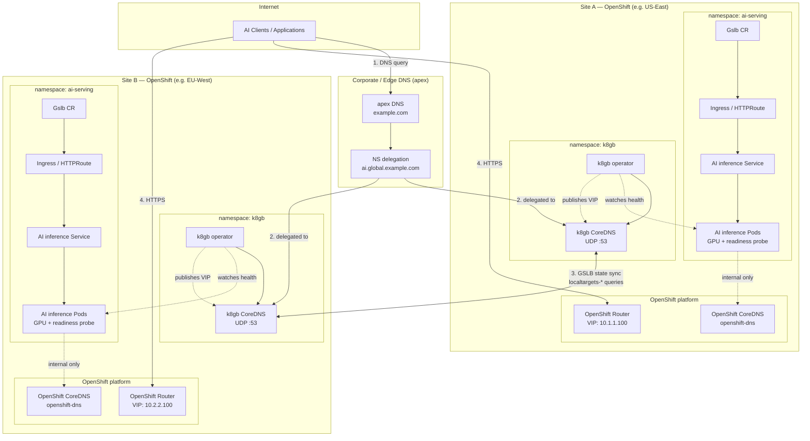
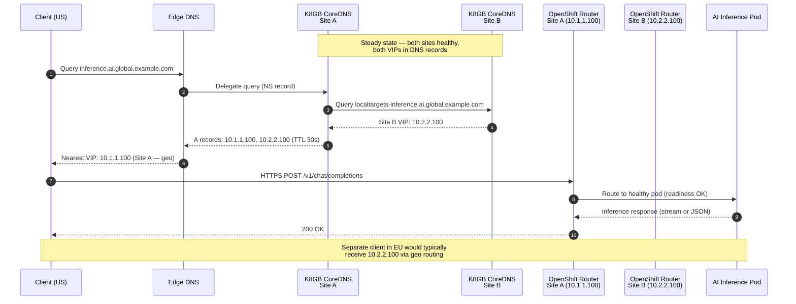
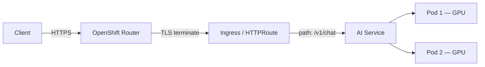
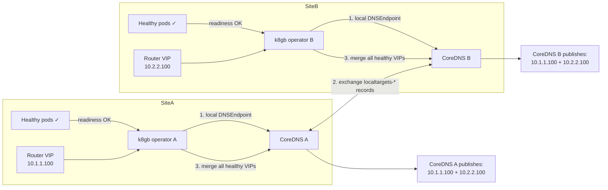
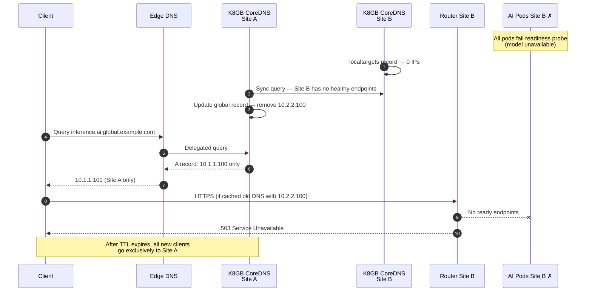
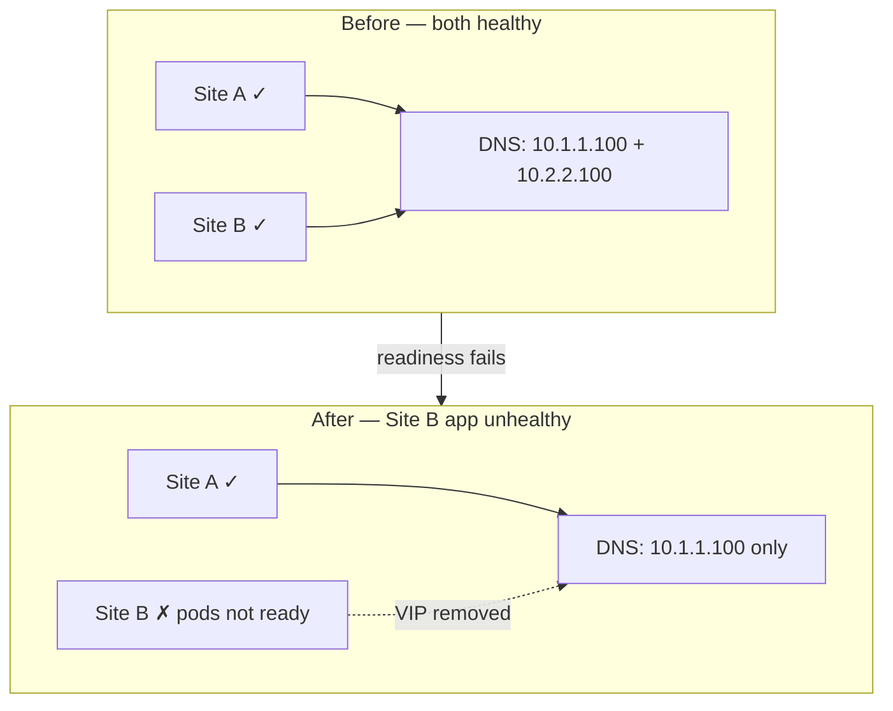
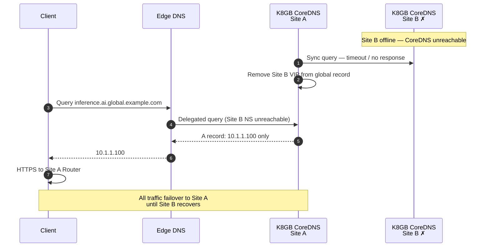
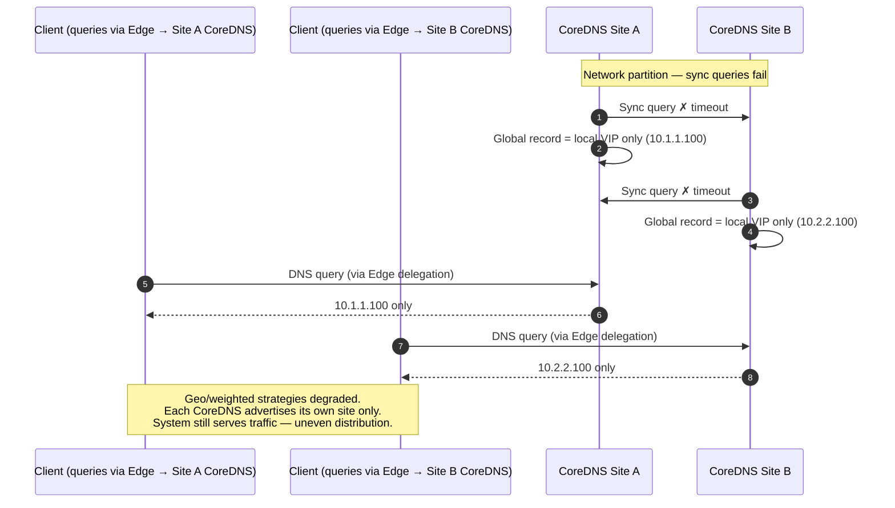
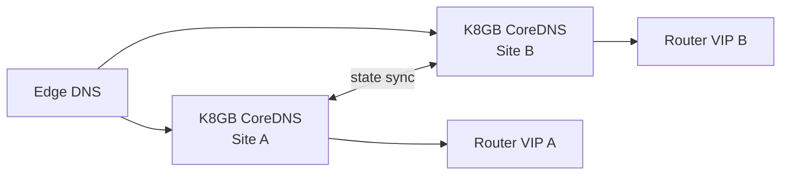

# Global Load Balancing for Multi-Site OpenShift AI Services

A reference guide for replacing F5 (or physical) global load balancers with open-source, Kubernetes-native options — specifically [K8GB](https://www.k8gb.io/) — across two active/active OpenShift sites running AI inference workloads.

---

## Executive Summary

| Question | Answer |
|----------|--------|
| Can F5 GSLB be replaced with an OSS Kubernetes project? | **Yes** — K8GB is the primary purpose-built option |
| Where is K8GB deployed? | **Inside each OpenShift cluster** (both sites); no separate GLB cluster |
| Does it work on OpenShift? | **Yes** — documented by Red Hat; **not** Red Hat subscription-supported |
| Does it replace OpenShift CoreDNS? | **No** — it adds a separate CoreDNS instance for GSLB zones only |
| Best fit for active/active AI sites? | K8GB (geo or weighted DNS) + per-site OpenShift Router/Ingress for L7 routing |

---

## Problem Statement

- Two **independent, active/active** sites serving **AI services**
- Need a **global load balancer** that is aware of application health (and optionally request-level routing)
- **Time-constrained** — cannot wait for F5 or physical load balancer procurement
- Platform: **Red Hat OpenShift**

---

## Architecture and Traffic Flow

Global load balancing requires **two layers**. The diagrams below show the full component layout, normal active/active traffic flow, and three failure scenarios.

| Layer | Responsibility | Technology |
|-------|----------------|------------|
| **Global (GSLB)** | Which site gets the client (geo, weighted, failover) | K8GB + Edge DNS |
| **Per-site (L7)** | Path/header routing, TLS, timeouts, rate limits | OpenShift Router, Ingress, Gateway API |

---

### 1. Component Architecture

Full view of both OpenShift sites, DNS delegation, and internal cluster components.



**Legend:**

- **Edge DNS** delegates `ai.global.example.com` to K8GB CoreDNS at both sites (not to F5).
- **K8GB CoreDNS** is separate from **OpenShift CoreDNS** — they do not replace each other.
- **K8GB operator** watches pod readiness and publishes Router VIPs into K8GB CoreDNS.
- **Gslb CR** on both sites references the same hostname: `inference.ai.global.example.com`.

---

### 2. Normal Operation — Active/Active Traffic Flow

Both sites are healthy. DNS returns both Router VIPs. Clients are steered by geo/latency or round robin.



**Normal-state DNS record (conceptual):**

```
inference.ai.global.example.com.  30  IN  A  10.1.1.100   ← Site A Router VIP
inference.ai.global.example.com.  30  IN  A  10.2.2.100   ← Site B Router VIP
```

**Per-request path inside a site (after DNS):**



---

### 3. Normal Operation — K8GB State Synchronisation

How both K8GB instances converge on the same global DNS view.



Both CoreDNS instances converge to the **same answer** — both VIPs — when both sites are healthy.

---

### 4. Failure Scenario A — AI Application Unhealthy at Site B

Inference pods at Site B fail readiness (GPU OOM, model not loaded). Site A remains healthy. K8GB removes Site B's VIP from DNS.



**DNS before failure:**

```
inference.ai.global.example.com.  30  IN  A  10.1.1.100
inference.ai.global.example.com.  30  IN  A  10.2.2.100
```

**DNS after failure (automatic):**

```
inference.ai.global.example.com.  30  IN  A  10.1.1.100   ← Site A only
```



**Impact:** Site A absorbs all new traffic. Existing streaming sessions to Site B may fail until clients reconnect.

---

### 5. Failure Scenario B — Entire Site B Unavailable

Site B datacenter, cluster, or K8GB CoreDNS is down. Site A continues serving all traffic.



```mermaid
flowchart TB
  Client[Clients worldwide]
  Edge[Edge DNS]
  SiteA["Site A ✓<br/>OpenShift + K8GB + AI"]
  SiteB["Site B ✗<br/>datacenter / cluster down"]

  Client --> Edge
  Edge -->|only reachable NS| SiteA
  Edge -.x|NS timeout| SiteB
  Client -->|all HTTPS traffic| SiteA

  style SiteB fill:#fee,stroke:#c00
  style SiteA fill:#efe,stroke:#090
```

**Impact:** Full failover to Site A. Monitor Site A capacity (GPU, QPS) — it now handles 100% of load.

---

### 6. Failure Scenario C — Network Partition Between Clusters

Both sites and apps are running, but K8GB instances **cannot reach each other's CoreDNS**. Clients and Edge DNS can still reach both sites. **Degraded active/active.**



```mermaid
flowchart TB
  subgraph Partition["Network partition between sites"]
    subgraph SiteA["Site A — isolated from Site B sync"]
      A1[k8gb A] --> A2[CoreDNS A]
      A2 --> A3["DNS answer: 10.1.1.100"]
    end

    subgraph SiteB["Site B — isolated from Site A sync"]
      B1[k8gb B] --> B2[CoreDNS B]
      B2 --> B3["DNS answer: 10.2.2.100"]
    end

    A1 -.x.-x B1
  end

  Edge[Edge DNS] --> A2
  Edge --> B2

  style Partition fill:#fff8e1,stroke:#f9a825
```

**Impact:** Not a full outage — both sites still serve clients. Load balancing strategy is degraded; traffic may skew based on which CoreDNS Edge DNS contacts. **Test and document this scenario before production.**

---

### Traffic Flow Summary

| Scenario | DNS answer | Traffic destination | User impact |
|----------|------------|---------------------|-------------|
| **Normal (active/active)** | Both VIPs: 10.1.1.100 + 10.2.2.100 | Split by geo/weight | Optimal — both sites utilised |
| **Site B app unhealthy** | Site A VIP only | 100% → Site A | Failover; possible 503 for cached DNS clients |
| **Site B fully down** | Site A VIP only | 100% → Site A | Full failover; watch Site A capacity |
| **Network partition** | Depends on which CoreDNS is queried | Skewed / local-only | Degraded — both sites up, GSLB policy inconsistent |

---

## Why K8GB?

[K8GB](https://github.com/k8gb-io/k8gb) (Kubernetes Global Balancer) is a CNCF-oriented operator that provides DNS-based global server load balancing across geographically dispersed Kubernetes/OpenShift clusters.

**Key capabilities:**

- Operator + `Gslb` Custom Resource Definition (CRD)
- Load balancing strategies: round robin, weighted round robin, failover, GeoIP
- Health driven by Kubernetes readiness/liveness probes
- DNS backends: Route53, Cloudflare, Infoblox, Azure DNS, GCP Cloud DNS, CoreDNS
- Decentralized — no central control cluster
- GitOps-friendly (Helm, Kustomize, Argo CD)

**References:**

- [K8GB documentation](https://www.k8gb.io/)
- [Global load balancing on Red Hat OpenShift with K8GB (Red Hat blog)](https://www.redhat.com/en/blog/global-load-balancing-red-hat-openshift-k8gb)
- [OpenShift Commons Briefing: K8GB](https://www.redhat.com/en/blog/openshift-commons-briefing-k8gb-kubernetes-global-balancer-with-yuri-tsarev-absa-and-paul-morie-red-hat)

---

## Active/Active Configuration

Both sites serve traffic simultaneously under normal conditions. K8GB removes a site from DNS when it becomes unhealthy.

### Recommended strategies

| Strategy | When to use |
|----------|-------------|
| **GeoIP / latency** | Sites in different regions; send clients to nearest healthy site |
| **Weighted round robin** | Equal or uneven capacity split (e.g. 50/50 or 66/33 if GPU counts differ) |
| **Hybrid** | Geo primary + automatic failover to the other site |

### Active/active caveats for AI workloads

1. **DNS steers clients, not individual HTTP requests** — each client (or DNS cache) is pinned to one site for the TTL duration.
2. **Streaming APIs (SSE/WebSocket)** — long-lived connections stay on one site; plan session affinity and conservative failover.
3. **Stateless REST inference** — ideal for active/active; ensure models and config are replicated per site.
4. **Health checks must reflect inference readiness** — not just "pod is running" (e.g. model loaded, GPU available). Use endpoints like `/v1/models` or a dedicated health API.
5. **Configure long timeouts** on Routes/Ingress (AI inference may need 300s+).

---

## Where to Deploy K8GB

K8GB uses a **decentralized** model: install the operator on **every participating cluster**. There is no dedicated GLB cluster and no F5-style hardware.

See [§1 Component Architecture](#1-component-architecture) for the full diagram.



### Component placement

| Component | Location | Notes |
|-----------|----------|-------|
| K8GB operator | Both clusters (`k8gb` namespace) | Helm install per site |
| K8GB CoreDNS | Both clusters (with Helm chart) | Authoritative DNS for delegated GSLB zone |
| `Gslb` CR | Both clusters (app namespace) | Same hostname and logical name on each site |
| AI services | Both clusters | Already deployed |
| OpenShift Router / Ingress | Both clusters | Entry point K8GB health-checks |
| Edge DNS | External (Route53, Infoblox, etc.) | Zone delegation to K8GB CoreDNS |
| Dedicated GLB VM / F5 | Not required | Replaced by K8GB |

### Helm install (per cluster)

Each site needs a unique geo tag and peer cluster tags:

```bash
# Site A
helm repo add k8gb https://www.k8gb.io
helm install k8gb k8gb/k8gb \
  --namespace k8gb --create-namespace \
  --set k8gb.clusterGeoTag=site-a \
  --set k8gb.extGslbClustersGeoTags=site-b \
  --set k8gb.dnsZone=example.com \
  --set openshift.enabled=true

# Site B
helm install k8gb k8gb/k8gb \
  --namespace k8gb --create-namespace \
  --set k8gb.clusterGeoTag=site-b \
  --set k8gb.extGslbClustersGeoTags=site-a \
  --set k8gb.dnsZone=example.com \
  --set openshift.enabled=true
```

### Example Gslb resource

```yaml
apiVersion: k8gb.io/v1beta1
kind: Gslb
metadata:
  name: ai-inference
  namespace: ai-serving
spec:
  strategy:
    type: geoip          # active/active: geoip or roundRobin
  resourceRef:
    apiVersion: networking.k8s.io/v1
    kind: Ingress
    name: ai-api-ingress
```

Deploy the same `Gslb` (same hostname) on both sites. When both are healthy, DNS includes both site Router VIPs.

---

## OpenShift Support

| Aspect | Status |
|--------|--------|
| Runs on OpenShift 4.x | Yes |
| Red Hat subscription support | **No** — community / CNCF supported |
| Red Hat documentation | Yes — see links above |
| OpenShift Helm flag | `--set openshift.enabled=true` (Route RBAC for `routes/custom-host`) |

### Application exposure on OpenShift

K8GB `resourceRef` supports:

| Resource | Supported |
|----------|-----------|
| Kubernetes Ingress | Yes (used in Red Hat examples) |
| Gateway API HTTPRoute | Yes (OCP 4.14+ with Gateway API) |
| LoadBalancer Service | Yes (requires `k8gb.io/hostname` annotation) |
| OpenShift Route (native) | **No** — use Ingress, HTTPRoute, or LoadBalancer Service |

K8GB sits **above** the OpenShift Router; it does not replace it.

---

## K8GB CoreDNS vs OpenShift CoreDNS

**K8GB does not replace Red Hat's cluster CoreDNS.** Both coexist.

| | OpenShift CoreDNS | K8GB CoreDNS |
|---|-------------------|--------------|
| Managed by | OpenShift DNS Operator | K8GB Helm chart |
| Namespace | `openshift-dns` | `k8gb` |
| Purpose | In-cluster service discovery (`*.cluster.local`) | Global GSLB DNS for delegated public zone |
| Used by | All pods (via kubelet) | External clients + inter-cluster K8GB sync |
| Required? | Yes — do not remove | Added for GSLB only |

Optional: if pods inside the cluster must resolve global GSLB hostnames, configure the OpenShift DNS Operator to forward that zone to K8GB CoreDNS:

```yaml
# oc edit dns.operator/default
spec:
  servers:
  - name: k8gb-zone
    zones:
    - ai.global.example.com
    forwardPlugin:
      upstreams:
      - <k8gb-coredns-service-ip>
```

---

## Deployment Options by Urgency

### Fast path (days) — managed global LB

If time is critical, use a managed service with two origin pools (Site A + Site B):

- Cloudflare Load Balancing
- Azure Front Door
- AWS Global Accelerator + ALB
- GCP External HTTP(S) Load Balancer

Best when you need geo routing, L7 path rules, and health checks without operating K8GB.

### OSS path (1–2 weeks) — K8GB on OpenShift

Best when both sites are OpenShift, you want GitOps-native GSLB, and you can operate community software.

**Prerequisites per site:**

1. Install K8GB operator (Helm, `openshift.enabled=true`)
2. Expose K8GB CoreDNS on UDP port 53 (NLB, MetalLB, or NGINX UDP)
3. Configure DNS zone delegation from corporate DNS
4. Deploy `Gslb` CR referencing Ingress/HTTPRoute
5. Align readiness probes with real inference health
6. Test failure scenarios (app down, CoreDNS down, network partition)

---

## What K8GB Does Not Replace

| Capability | Where it lives |
|------------|----------------|
| TLS termination | OpenShift Router / Ingress |
| Path/header routing (`/v1/chat`, model headers) | Ingress, Envoy Gateway, Kong — per site |
| GPU scheduling and autoscaling | OpenShift + inference stack (KEDA, HPA) |
| WAF / DDoS / hardware ADC features | Separate edge security layer if required |
| Red Hat support | Not included — community project |

---

## Failure Scenarios to Test

Before production, validate the three scenarios diagrammed in [Architecture and Traffic Flow](#architecture-and-traffic-flow):

| # | Scenario | Expected outcome | Section |
|---|----------|------------------|---------|
| A | AI application unhealthy at one site | Unhealthy site VIP removed from DNS; traffic to healthy site | [§4](#4-failure-scenario-a--ai-application-unhealthy-at-site-b) |
| B | Entire site / CoreDNS unavailable | Remaining site serves 100% of traffic | [§5](#5-failure-scenario-b--entire-site-b-unavailable) |
| C | Network partition between clusters | Degraded GSLB — each site advertises local VIP only | [§6](#6-failure-scenario-c--network-partition-between-clusters) |

Source: [Red Hat K8GB guidance](https://www.redhat.com/en/blog/global-load-balancing-red-hat-openshift-k8gb)

**Recommended test procedure:**

1. Baseline — confirm both VIPs in DNS and traffic split across sites.
2. Scale Site B inference pods to zero — verify DNS drops `10.2.2.100` within TTL (~30s).
3. Block UDP 53 between Site A and Site B K8GB CoreDNS — observe partition behaviour.
4. Restore Site B — confirm both VIPs reappear and traffic rebalances.

---

## Decision Checklist

| Question | Implication |
|----------|-------------|
| Public internet or private WAN? | Public → CDN/managed GLB; private → K8GB + internal DNS |
| Active/active or active/passive? | Active/active → geo or weighted; passive → failover strategy |
| Same region or different regions? | Same region → weighted RR; different → geo/latency |
| Streaming or REST-only? | Streaming → session affinity, long timeouts |
| Need Red Hat vendor support for GLB? | K8GB is community-only; consider managed GLB or F5 |
| Equal GPU capacity per site? | Adjust weighted ratios if not 50/50 |

---

## Recommended Stack (Active/Active AI on OpenShift)

1. **Global:** K8GB on both clusters — GeoIP or weighted round robin
2. **Health:** Inference-aware readiness probes on AI pods
3. **Per-site L7:** OpenShift Route or Gateway API HTTPRoute for request routing
4. **Monitoring:** QPS, latency p95, GPU utilization, error rate — **per site**
5. **DNS:** Corporate DNS delegates GSLB subdomain to K8GB CoreDNS at each site

---

## Further Reading

- [K8GB — Getting Started](https://www.k8gb.io/intro/)
- [K8GB — Resource References (Ingress, Gateway API, Service)](https://www.k8gb.io/resource_ref/)
- [K8GB — Exposing DNS UDP Traffic](https://www.k8gb.io/exposing_dns/)
- [OpenShift DNS Operator documentation](https://docs.redhat.com/en/documentation/openshift_container_platform/latest/html/networking_operators/dns-operator)
- [CNCF: Exploring multi-cluster fault tolerance with k8gb](https://www.cncf.io/blog/2025/02/19/exploring-multi-cluster-fault-tolerance-with-k8gb/)

---

## License & Disclaimer

This document is an architecture reference based on community and Red Hat published guidance. K8GB is not a Red Hat product and is not covered by OpenShift subscription support. Validate all designs in non-production environments before rollout.
